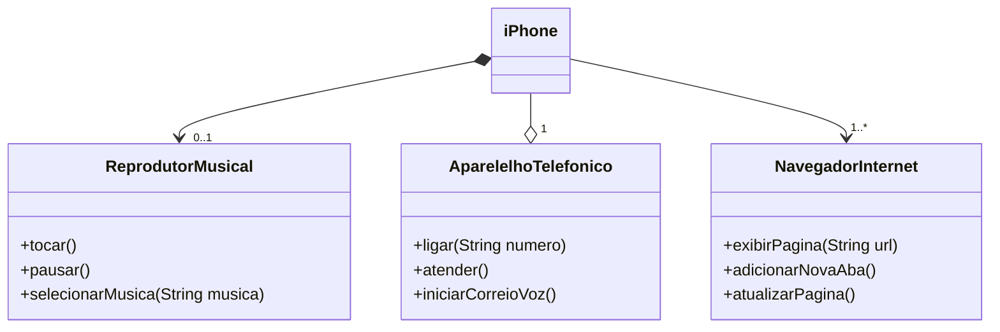

```mermaid
classDiagram
    class iPhone{ 
    }
    
    iPhone *--> "0..1" ReprodutorMusical 
    iPhone --o "1" AparelelhoTelefonico
    iPhone --> "1..*" NavegadorInternet

    class ReprodutorMusical {
    +tocar()
    +pausar()
    +selecionarMusica(String musica)
    }

    class AparelelhoTelefonico { 
    +ligar(String numero)
    +atender()
    +iniciarCorreioVoz()
    }

    class NavegadorInternet {
    +exibirPagina(String url)
    +adicionarNovaAba()
    +atualizarPagina()
    }
```

